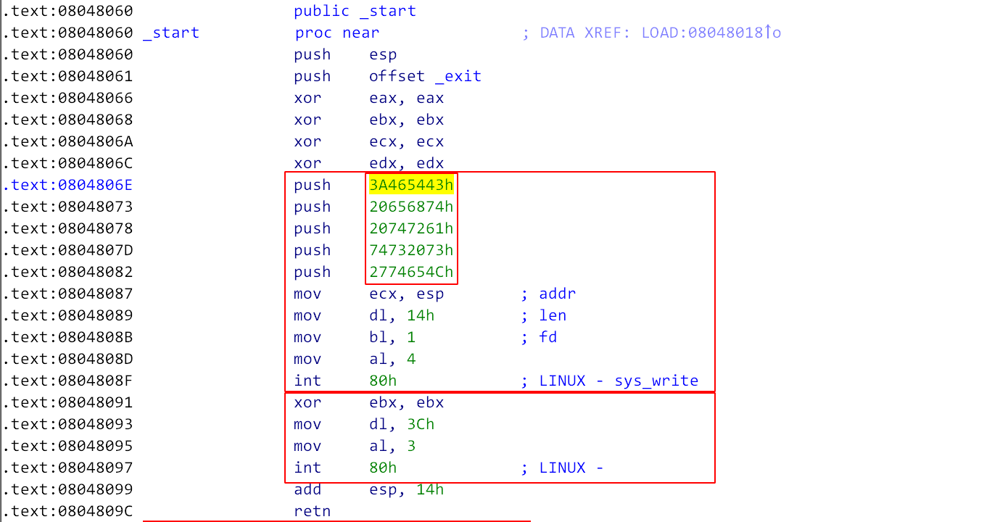

## Pwnable.tw start
#### 需要掌握的知识点
- Linux 32Bit System Call in Assembly

#### 代码分析


汇编代码，现在回过头再看确实很简单。

分为三个部分: 初始化、调用Write来进行输出、调用Read读取输入

#### 漏洞分析
##### Stage 1 
很明显是缓冲区溢出，这题没有其他的东西，应该是自己要写shellcode

根据: [Linux 32Bit SystemCall Table](http://shell-storm.org/shellcode/files/syscalls.html)
```
eax = 0, ebx = '/bin/sh', ecx = 0, edx = 0
```

##### Stage 2
第二阶段就是确定返回地址，转到我们写的shellcode上面，返回地址很显然是在栈上面，现在的目标就是获取ESP地址。

这里就是积攒经验了。方式如下：缓冲区溢出重新定位到Write()函数，此时会把旧EBP输出，如此就可以获取ESP。
溢出到Write函数时，栈空间如下
```
                  +---------------------+
                  +        'CTF'        +
                  +---------------------+
                  +         ...         +
                  +---------------------+
                  +         ebp         +
                  +---------------------+
                  +    retq( write )    +
                  +---------------------+
      esp ----->  + 之后被shellcode覆盖 +
                  +---------------------+
                  + 之后被shellcode覆盖 +
                  +---------------------+
      ebp ----->  +       旧 EBP        +
                  +---------------------+
                  +   retq(shellcode)   +
                  +---------------------+
```
##### Stage 3
流程为Write-->Read溢出-->Write-->Read溢出-->ShellCode 

这里就是我强行提高难度了，假设缓冲区中返回地址下方空间不够。那就要使用JUMP指令


#### 坑点
小白，栈空间是变化的，没得说了。

#### 总结反思
- 经验
    - 泄露栈地址的一个方法：利用Write-Read 重新运行代码
- 知识
    - Linux 32Bit System Call(即如何编写Shellcode)
