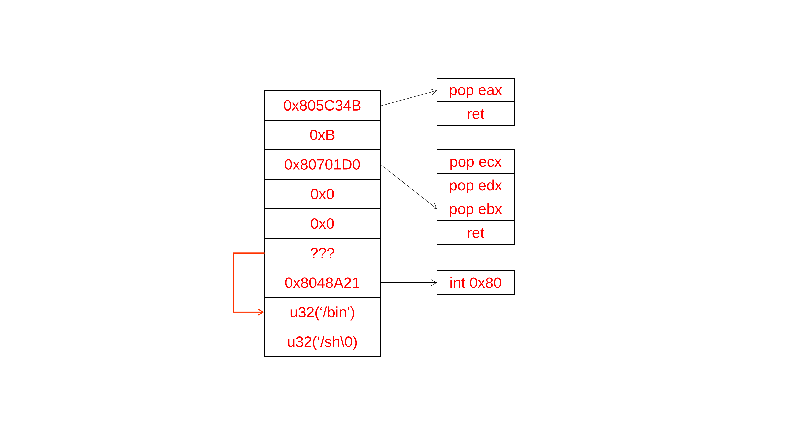

# Pwnable tw calc
## 需要掌握的知识点
- 基础 ROP: Ret2syscall && Ret2libc

## 代码分析
### main 方法
```cpp
int __cdecl main(int argc, const char **argv, const char **envp)
{
    int v3; // ebx
    int v4; // ecx

    ssignal(14, (int)timeout);
    alarm(v4, v3);
    puts("=== Welcome to SECPROG calculator ===");
    fflush(stdout);
    calc();
    return puts("Merry Christmas!");
}
```
alarm 函数没有好说的，重点就是 `calc()` 函数

### calc && get_expr && parse_expr
代码就不贴了，说一下代码实现功能，输出表达式字符串到 expr 数组，处理 expr 数组，处理方法相当于是栈章节学习的处理表达式方法，就是用一个数组模拟栈，把那些临时数字放入数组里面。然后数组的第一位固定表示是栈的长度，这样就可以知道栈里面的数据 push 到哪个位置。

## 漏洞分析
### Stage 1 
想了很久，但是没有想到有哪些可利用的地方，后来看了别人的题解，感觉这应该是一种经验吧。

可以看到他的实现方式是实现这样的结构：数组首位为长度，后面为内容。这样就有破绽，如果能够修改首位，可能会出问题。
这道题的破绽在下面语句。
```cpp
_DWORD *__cdecl eval(_DWORD *num_stack, char op)
{
    _DWORD *result; // eax
    if ( op == '+' )
        num_stack[*num_stack - 1] += num_stack[*num_stack];
    result = num_stack;
    --*num_stack;
    return result;
}
```
这里很关键的是没有检查刚开始的情况, 如果输入 '+20' 这种语句, 会出错的. 

刚开始 num_stack[0] == 1，那就相当于改掉了 num_stack[0] 的数据，此时 num_stack[0] 就失去对真实长度的准确性。

例子如下。
```
说明
1. 每次往num_stack添加数据，num_stack[0]会加一
2. 每次往num_stack添加数据，添加位置是num_stack[*num_stack]
3. 假设num_stack[360] == 100

表达式: +360+10

Round 1
num_stack[0] = 1, num_stack[1] = 360, op = '+'
num_stack[0] += num_stack[1] ---> num_stack[0] = 361
--*num_stack ---> num_stack[0] = 360

Round 2
num_stack[0] = 361, num_stack[361] = 10, op = '+'
num_stack[360] += num_stack[361] ---> num_stack[360] = 110
--*num_stack ---> num_stack[0] = 360

最终结果: 会改掉num_stack[360]内的数据
```
所以我们可以修改任意位置的数据！并且修改为任何数据。比如想改 num_stack[360]，那么首先输入+360，获取数据，然后比较我们想改的值，假设差值为100，那么就输入+360+100，最终成功。

### Stage 2
确认现在的突破口：我们即可以获取任意地址的数据，也可以修改任意地址的数据！

第一想法，在某一段写shellcode，然后要么返回地址转到该处，要么finarray某一项改为该处。

在 GDB 中查看信息，利用 vmmap，很显然没有哪一段是即有w，又有x，因此该想法失败。
```
0x08048000 0x080eb000 0x00000000 r-x /home/allen/Work/Pwn/pwnable004/calc
0x080eb000 0x080ed000 0x000a2000 rw- /home/allen/Work/Pwn/pwnable004/calc
0x080ed000 0x08111000 0x00000000 rw- [heap]
0xf7ffa000 0xf7ffd000 0x00000000 r-- [vvar]
0xf7ffd000 0xf7ffe000 0x00000000 r-x [vdso]
0xfffdd000 0xffffe000 0x00000000 rw- [stack]
```

### Stage 3
既然不能采用这样操作，又因为不是动态链接，所以不能用 Ret2libc，那么就只能采用 Ret2syscall 的方法。构造栈结构如下。


### Stage 4
现在还差一个 `/bin/sh` 的地址, 这个也很容易想到：通过输出 `ebp` 指向的内存内容, 该内容为 `old ebp`, 它和我们要找的地址偏移量是固定的, 所以可以调试得到结果.

## 坑点
### Python 的有符号和无符号处理
假设地址0xFFFFFFFFF，按有符号数来说是-1，按无符号数来说是4294967295

在Python中，假设A = -1，如果(A & 0xFFFFFFFFF)，最后输出结果是4294967295

虽然这样是对的，但是对面下面的语句
```
if old_value < stack[i]:
    p.sendline('+' + str(address) + '+' + str(stack[i] - old_value))
else:
    p.sendline('+' + str(address) + '-' + str(old_value - stack[i]))
```

假设old_value = 1
``` 
如果stack[i] == -1，那最后输出+(1-(-1)) = +2，最终结果为 1+2=3
如果stack[i] == 4294967295，那最后输出+(4294967295-1) = 4294967294，最终结果为 1+4294967294=4294967295
```

所以最后结果处理方式应该如下
```
if stack[i] < 0:
    stack[i] = (1<<32) - stack[i]
```

## 总结反思
- 经验
    - 一种看似巧妙但是有破绽的结构： 数组首位表示长度，后面为数据内容
    - 上述结构破解方式：想方法用arr[0] + arr[x]，即修改掉arr[0]的数据

- 知识
    - 虽然有符号和无符号的二进制都是一样的，但是有些情况下会有所影响(见坑点)
    - 构造ROP 以及 ROPgadget 使用
