# Pwnable tw dubblesort

## 代码分析

### main方法
```cpp
int main(int argc, const char **argv, const char **envp)
{
    int num_arr; // [esp+1Ch] [ebp-70h]
    printf(1, (int)"What your name :");
    read(0, &buf, 0x40u);
    printf(1, (int)"Hello %s,How many numbers do you what to sort :");
    scanf("%u", &count);
    // input value to num array
    if ( count )
    {
        pointer = &num_arr;
        index = 0;
        do
        {
            printf(1, (int)"Enter the %d number : ");
            fflush(stdout);
            scanf("%u", pointer);
            ++index;
            ++num_arr;
        }
        while ( count > index );
    }
    // sort num array
    my_sort((unsigned int *)&num_arr, count);
    puts("Result :");
    if ( count )
    {
        // print sorted num_array
    }
    return result;
}
```
上面是我精简后的代码，可以看到代码量还是不大的，就是先输入然后排序最后输出。


## 漏洞分析
### Stage 1 
在栈中，数组的长度 (count) 就在数组的上面，所以很容易联想到 pwnable tw calc 中的方法，就是能否修改掉 count，想了一会，很遗憾，似乎是不可以的。

### Stage 2
再进行分析，很容易看到 num_arr 数组会溢出，因为 count 上限远比 0x40u 大，所以我们可以很轻松地输入大量数据到 num_arr 从而溢出，估摸着应该是 Ret2syscall 或者 Ret2libc。

### Stage 3
因为有 Canary, 所以溢出这条路被堵死了. 但是 `scanf` 有一个 Trick, 通过它我们竟然可以绕过 Canary！
```
对于 scanf('%u')，如果输入'+'或者'-'，那么他会当做正确字符读入，但处理的时候会忽略掉它，不会更改相关内存数据
```

### Stage 4
然后关键就是 `libc` 的基址在哪里, 这里利用了 `read-print` 组合这一漏洞: `read` 不在末尾添加 `\x00`, `print` 停止方式恰恰是检测 `\x00`, 所以如果 buf 后面恰好不是 `\x00`，就会泄露后面的内容。
```cpp
printf(1, (int)"What your name :");
read(0, &buf, 0x40u);
// 这里是 IDA 翻译的问题, 其实本质上就是下面这句 
// printf("Hello %s, balabala", buf)
printf(1, (int)"Hello %s,How many numbers do you what to sort :");
```

通过 GDB 进行调试, 看一下 `buf` 在栈中的范围, 看看范围里面有没有可能暴露 `libc` 信息, 经过调试发现 `buf+0x08` 就会暴露, 即它里面内容和 `libc` 基址偏移量是固定的, 因此可以 `buf == 'a'*8` 则让 `printf` 输出该内容.

### Stage 4
最终栈结构空间如下。



PS: 因为 `bin_sh_addr` > `system_addr`，一般来说 `system_addr` > Cookie，所以一般是会成功。不成功就再试一次，哈哈。

## 坑点
1. 返回的地址最后一节始终为00

假设为(System_address == 0xFFFFFF00)，又因为是小段模式。假设输入数据为(abcd)*N，printf的时候，栈空间分配如下。
```
+----+----+----+----+
+ 64 + 63 + 62 + 61 + --> send('abcd')
+----+----+----+----+
+ 64 + 63 + 62 + 61 + --> send('abcd')
+----+----+----+----+
+ FF + FF + FF + 00 + --> send(0xFFFFFF00)
+----+----+----+----+
```
而printf是逐步输出，所以结果为 Hello, abcdabcd,What，所以最终结果处理为 addr == ,Wha，完全和我们要的不一样。

这时就用IF判断一下，如果末尾为00，那就改为04，反正system前面一两句是无关痛痒的。

## 总结反思
- 经验
    - read-print 漏洞利用
    - scanf 中使用 '+'/'-' 可以不会改变数据

- 知识
    - send('abcd') 和 send(0xffffff00) 在栈空间分配是不一样的
