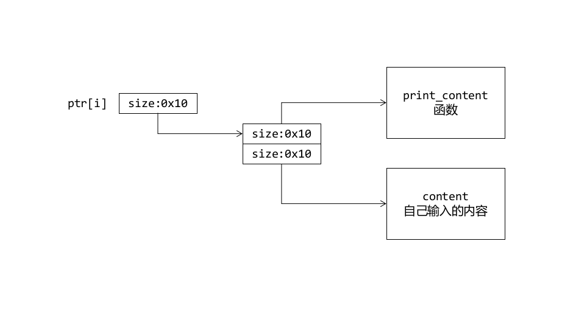

## Pwnable.tw hacknote
#### 需要掌握的知识点
- 堆的相关知识，这题需要知道: Fastbins

#### 代码分析

#### 漏洞分析
##### Stage 1 
这题没什么说的，就是堆的利用，理解什么是fastbin，清楚代码逻辑之后，定好如下的流程。

结构如图

```
1. Add 1 --> Size 16 --> content
2. Add 2 --> Size 16 --> content
3. Del 0
4. Del 1

fastbin[0] -- size=0x10 : [index 1] --> [index 0]
fastbin[1] -- size=0x20 : [content 1] --> [content 0]

5. Add 3 --> Size 10 --> content

此时index 2 == [index 1]，content 2 == [index 0]，因此可以对[index 0]进行更改
```

##### Stage 2
更改成什么，这是个问题，突破口在下面的打印内容的实现语句中。
```cpp
// ptr[index] == content
if ( ptr[index] )
    (*(void (__cdecl **)(void *))ptr[index])(ptr[index]);
```
如果你知道system可以参数截断的话，即system('test||sh') == system('sh')。那么就很简单了，我们就把ptr[index]改为system地址就好，ptr[index+4]改为'||sh'，这样只要更改完成之后打印好就可以了。

##### Stage 3
问题是，system 的地址怎么确定？这里面又涉及到了PLT 和 GOT 的概念了。知道了其实很简单，就是在第一次Add时输入内容为system@got的位置，然后输出一下，就能找到system真实位置了。

所以流程就是Add-->Print-->Compute-->Add-->Del-->Del-->Add-->Print

#### 坑点
1. system 参数可能会含有0

假设system 地址为0x61616100，那么就相当于system('aaa\0||sh')，那么就会处理成函数system('aaa')，显然会出错。

所以要利用位运算判断一下是否有00，如果有的话，就加上0x4，反正我们的目的是为了执行system函数，所以system函数开头部分没有必要执行。

#### 总结反思
- 经验
    - 对堆攻击的一种方式：两次申请两次释放再申请
- 知识
    - System 参数截断
    - Malloc函数及FastBin的介绍
    - GOT && PLT 在函数执行中的作用

