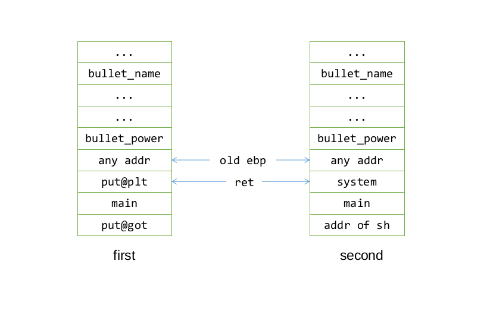

# Pwnable tw Silver_Bullet

## 代码分析
嗯，流程还是很简单的。
- Create: 创建一个 `Bullet` 对象, 有 `name`, `power`, 其中 `power` 紧挨着 `name`.
- Powerup: 往 `name` 里面添加内容, 并且增加 `power`, 保证 `power` 始终代表 `name` 的长度。

## 漏洞分析
### Stage 1 
直接说漏洞在哪吧: `Powerup->strncat`, 有 Off-by-one 风险. `strncat` 每次会在后面加个 `\x00`, 所以可能会让 `bullet.name` 后面的一个字节覆盖为 0. 而 `bullet.name` 后面四个字节正好表示 `bullet.power`, 所以我们可以利用 off-by-one 把 `power` 变为 0.

在 powerup 函数中, 通过判断 `power` 是否大于 0x2f 来决定能否继续在 `name` 后面写入数据. 这个逻辑很正常，就是为了防止 `name` 覆盖掉 `power`, 没想到最后因为不太熟悉 `strncat` 导致被利用。

所以我们把 `power` 变为 0，然后可以再一次写入，所以可以栈溢出

### Stage 2
栈溢出，要找 libc 基址，很简单了，和 dubblesort 一样，利用 got && plt，就可以，所以构造栈空间如下。

## 总结反思
- 知识
    - strncat 可能 Off-by-one，要敏感
- 经验
    - 栈溢出时利用 `put@got` 进行 `libc` 溢出
