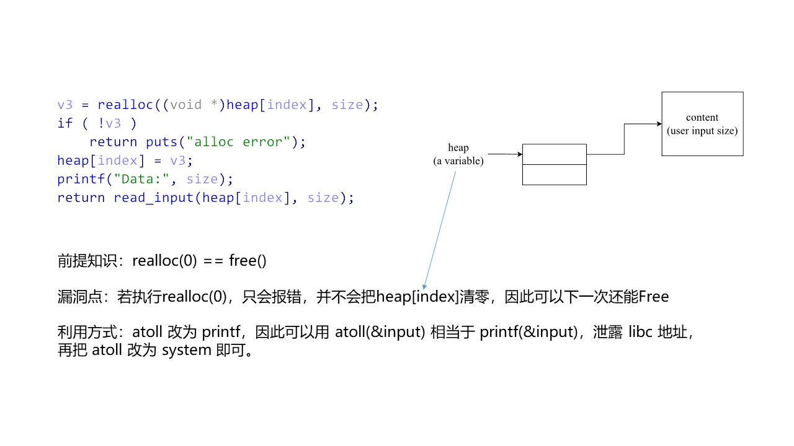

# Pwnable tw realloc

## 源码分析
菜单类题目，一共三个选择: `alloc`, `realloc`, `free`，其中我们就是利用了 `realloc` 中的漏洞点。

`realloc` 调用了 `realloc(ptr, size, content)` 这个函数，这个函数显而易见就是用来重新分配某块内存的。
- 如果 `size == 0`，那么很显然就是把原来的块 `free` 掉。
- 如果 `size < oldsize`，那么就是把剩下的块 `free` 掉。
- 如果 `size > oldsize`，那么就要先 `malloc(size)`，然后把原来的块 `free` 掉。
**但是这里有个特殊情况：如果这个原来块后面就紧接着 top chunk，那么很显然只要从 top chunk 割一点分给它就好了，不需要上述操作**
- 如果 `size == oldsize`，那么就保持不变，就是把块里面数据改成 `content` 即可。

上面这个还是比较直观的，仔细体会。本题就是没有判断是否 `realloc(0)`，所以可以造成 Double Free. 总体结构如下.



## 利用步骤

### 步骤一：统揽全局
在这直接说出本题的目标，算是一个该学到的姿势: 把 `atoll` 改成 `printf` 泄露，再改成 `system` 攻击。我知道很玄乎，看下面的步骤吧。

### 步骤二：`atoll` to `printf`

#### 第一步：`atoll_got` 放入 tcache bin 中
这个太简单了，就是 double free 即可，看下面的代码。对了，程序一共可以申请两个指针，比如 `my_alloc(0, ..)` 就是关于第一个指针的事。
```python
# 假定这个块为 node[0]
my_alloc(0, 0x18, 'AAAA')
# tcache[0x18]: node[0]
my_realloc(0, 0, '')
# tcache[0x18]: node[0] -> atoll_got
my_realloc(0, 0x18, p64(atoll_got))
# tcache[0x18]: atoll_got
# heap[0] == heap[1] == node[0]
my_alloc(1, 0x18, 'BBBB')
```
#### 第二步：`free` 不去污染 `atoll_got` 所在链表
下面我们还要继续利用这两个指针，所以要把他们先 `my_free` 掉，其中 `my_free` 函数会把当前指针清零。
否则在 `alloc` 中，程序发现它不是 0，就会提前终止。

现在的 `atoll_got` 在 `tcache[0x18]` 这个链表首部。堆里面只有一个 `[0x18]` 大小的块，`ptr0` 和 `ptr1` 都是指向它，设为 `node[0]`。

如果我们就是简单地 `my_free(0)`，那么很显然 `tcache[0x18]` 结构就会被破坏掉，所以要另辟蹊径。

1. 对于 `ptr0` 而言。

我们先 `my_realloc(0, 0x28, 'AAAA')`，可以想象现在 `realloc` 是什么样的行为？是不是先 `malloc` 再 `free`，大错特错！

因为 `node[0]` 后面就紧挨着 `top chunk`，所以系统是直接从 `top chunk` 割一点给 `node[0]` 即可！

所以这样 `node[0]` 大小就为 `0x28` 了，此时调用 `my_free(0)`，那么 `node[0]` 就乖乖在 `tcache[0x28]` 那个链表中去了。

2. 对于 `ptr1` 而言。

如果我们效仿 `ptr0` 会怎么样？要知道 `ptr1` 也是指向 `node[0]`，所以这样同样会让 `node[0]` 放入 `tcache[0x28]`，系统就检测到 Double Free 了。

所以我们要破坏系统的检测，系统检测 `tcache` 有没有 Double Free 是通过下面的 `key` 来进行检测的。
```cpp
typedef struct tcache_entry
{
  struct tcache_entry *next;
  struct tcache_perthread_struct *key; // 通过这个字段进行判断是否 Double Free
} tcache_entr
```

那么我们就这样: `my_alloc(1, 0x28, 'DDDDDDDDDDD')`，这样会让 `node[0]` 的 `key` 变成 `DDDD`，那么很显然再放入 `tcache` 中就不会检测到 Doube Free 了。

下面是这一步的代码
```python
my_realloc(0, 0x28, 'CCCC')
my_free(0)
my_realloc(1, 0x28, 'DDDDDDDDDDDDDDDD')
my_free(1)
```
#### 第三步：`atoll` 变为 `printf`
然后就直接通过 `my_alloc(0, 0x38, p64(print_plt))` 就可以了。
但是呢，这一步最好放到最后再去做。(看脚本就知道了)

### 步骤三：`atoll` to `system`
效仿步骤二即可。

### 步骤四：总体步骤
1. 首先将 `atoll` 放入 `tcache[0x18]` 和 `tcache[0x38]` 中去。
2. 将 `atoll` 变为 `printf`，程序调用 `atoll(&input)`，相当于 `printf(&input)`，这就可以格式化字符串攻击，最终可以得到 `system` 地址。
3. 将 `atoll` 变为 `system`，程序调用 `atoll(&input)`，就可以 `system(&input)`。注意这一步中 `atoll` 是 `printf`，`printf` 返回值是输入长度，比如需要 `my_alloc(1, 0x18, 'AAAA')`，那么就要改成 `my_alloc('a', 'a'*0x18, 'aaaa')`。
